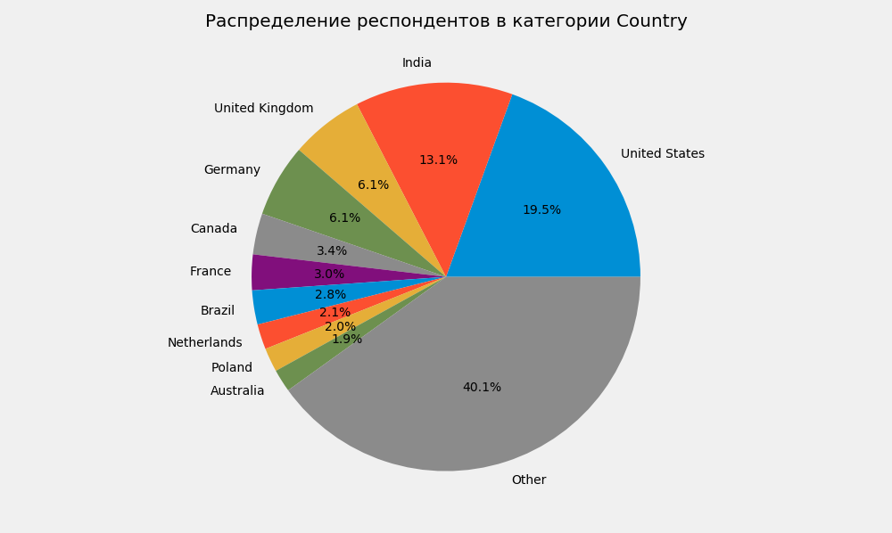
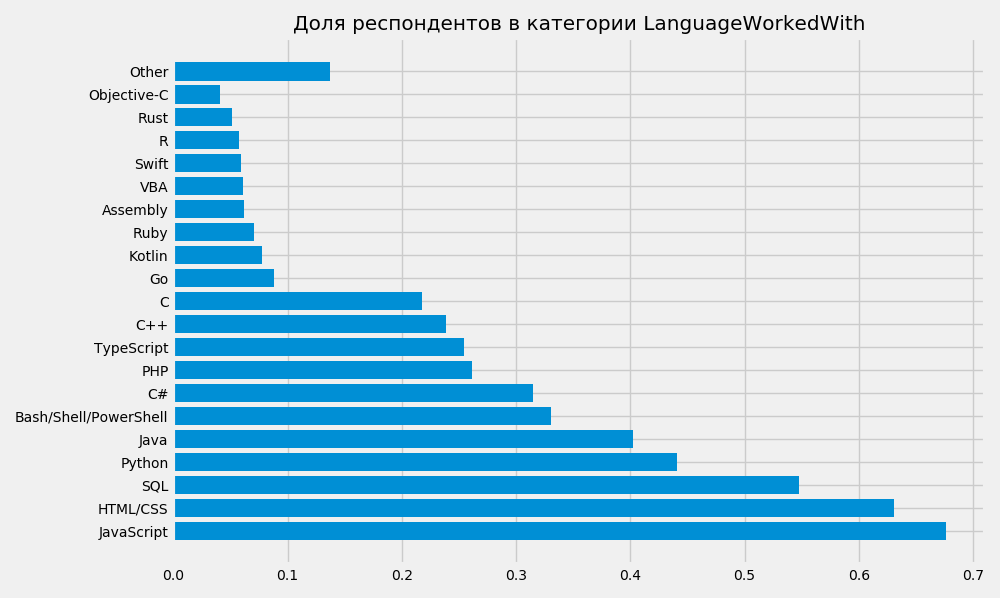
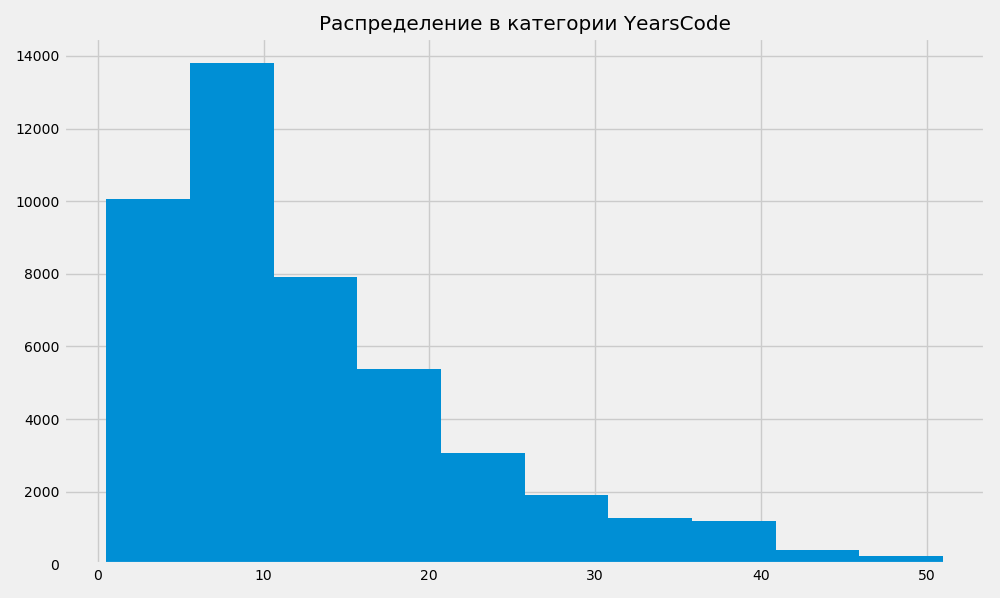
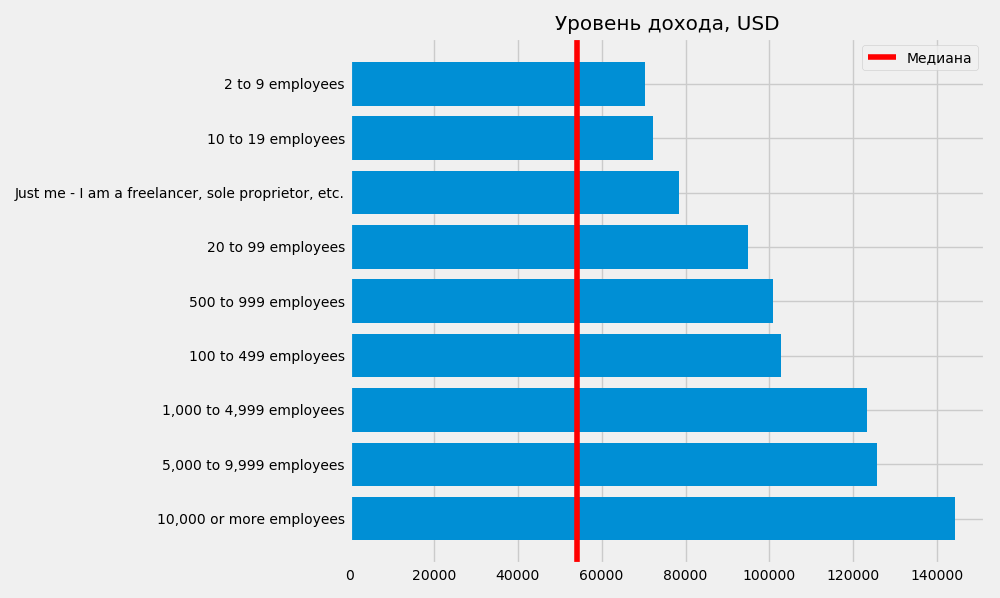
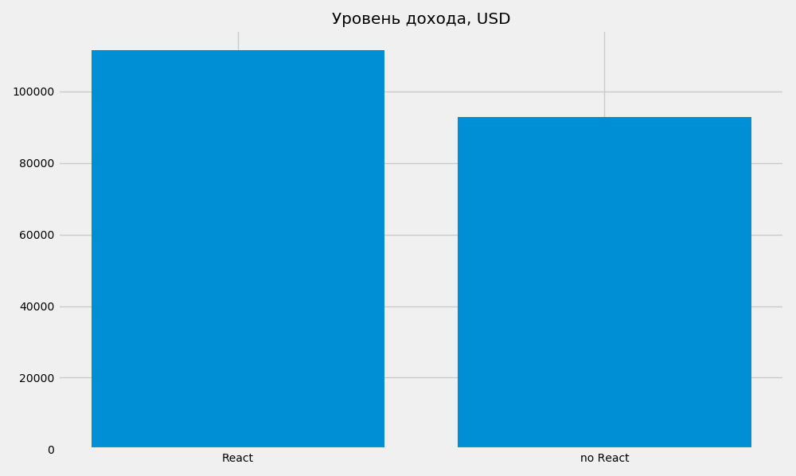

# Анализ Stack Overflow Developer Survey: опрос 2020 года

Источник данных: https://insights.stackoverflow.com/survey

Репозиторий содержит примеры кода для выполнения анализа числовых и категорийных параметров csv-файла. Для обработки исходных данных и визуализации используются функции, позволяющие обращаться к датафрейму и извлекать необходимые значения, передавая названия интересующих параметров и дополнительные условия обработки данных (способы группировки числовых значений, необходимость преобразования текстовых данных в числовые и проч.).

#### Пример обработки категорийного столбца, где каждая ячейка содержит только один вариант ответа

#### Пример обработки категорийного столбца, где ячейки содержат несколько вариантов ответа с разделителями

#### Пример визуализации числовых значений

#### Зависимость уровня дохода от значений категорийного столбца, где каждая ячейка содержит только один вариант ответа

#### Зависимость уровня дохода от наличия в категорийном столбце с множественными вариантами указанного значения

